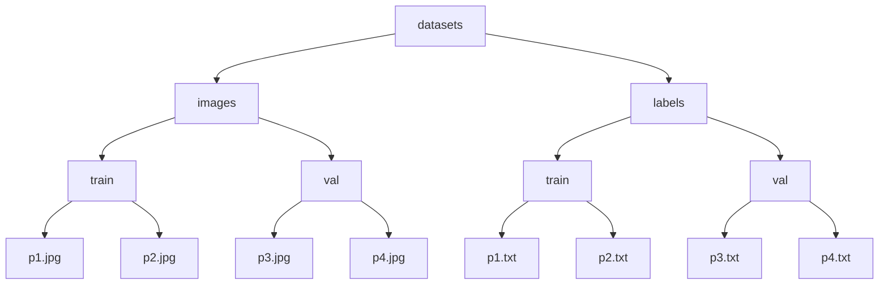
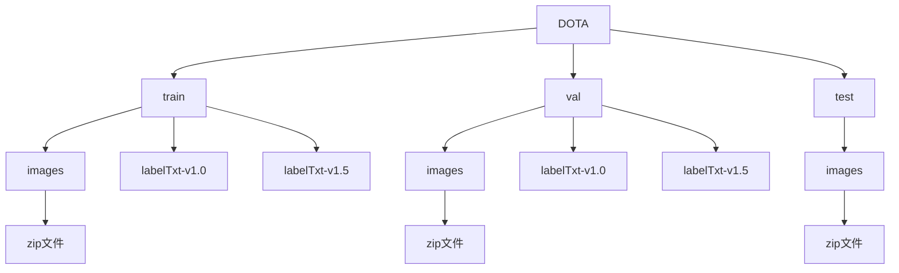
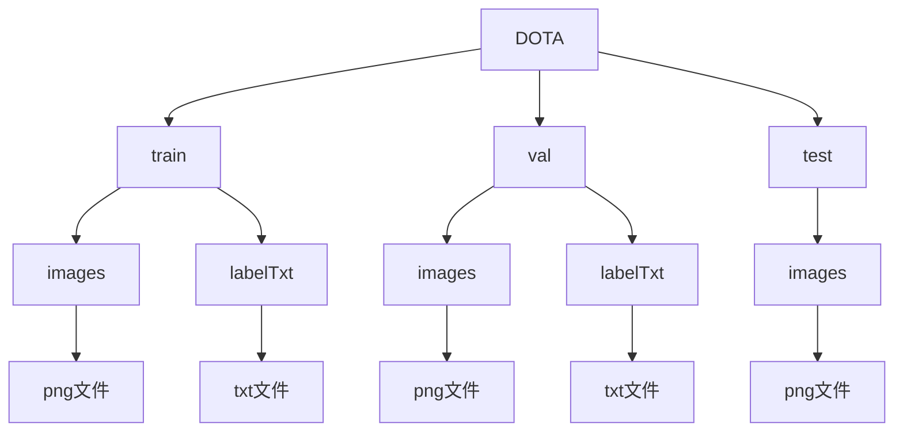
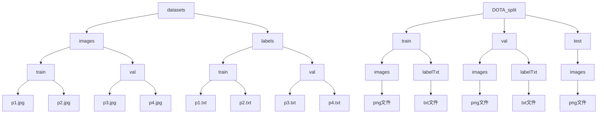
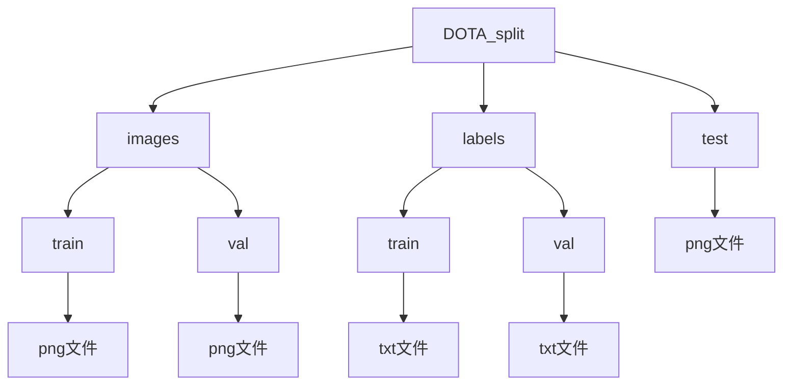

# 使用Ultralytics库训练DOTA遥感数据集

---
<div style="display: flex; align-items: flex-start; margin: 20px;">
  <!-- 左侧作者信息 -->
  <div style="flex: 1; padding: 10px; border-right: 1px solid #ddd;">
    <p>
    作者：
      
      中国计量大学——
      
      23智能3李昊洋、
    中国计量大学——
    23智能1王晶
    </p>
  </div>
  

  <!-- 右侧链接块 -->
  <div style="flex: 2; padding: 10px;">
    <!-- GitHub链接块 -->
    <div style="border: 1px solid #ddd; border-radius: 10px; padding: 15px; margin-bottom: 15px; display: flex; align-items: center;">
      
      <div>
        <p style="margin: 0; font-size: 14px; color: #0366d6;">
          <a href="https://github.com/231055558" style="text-decoration: none; font-weight: bold;">GitHub: 231055558</a>
        </p>
        <p style="margin: 5px 0; font-size: 12px; color: #555;">欢迎访问我的github主页 repositories.</p>
      </div>
    </div>
    <!-- Bilibili链接块 -->
    <div style="border: 1px solid #ddd; border-radius: 10px; padding: 15px; margin-bottom: 15px; display: flex; align-items: center;">
      
      <div>
        <p style="margin: 0; font-size: 14px; color: #0366d6;">
          <a href="https://www.bilibili.com/video/BV1kqBbYREMu/" style="text-decoration: none; font-weight: bold;">配套视频链接</a>
        </p>
        <p style="margin: 5px 0; font-size: 12px; color: #555;">bilibili:别卷了李师傅</p>
      </div>
    </div>
    <!-- CSDN链接块 -->
    <div style="border: 1px solid #ddd; border-radius: 10px; padding: 15px; display: flex; align-items: center;">
      
      <div>
        <p style="margin: 0; font-size: 14px; color: #0366d6;">
          <a href="https://blog.csdn.net/lhy2310/article/details/144002065?sharetype=blogdetail&sharerId=144002065&sharerefer=PC&sharesource=lhy2310&spm=1011.2480.3001.8118" style="text-decoration: none; font-weight: bold;">CSDN文章链接</a>
        </p>
        <p style="margin: 5px 0; font-size: 12px; color: #555;">使用Ultralytics库训练DOTA遥感数据集</p>
      </div>
    </div>
  </div>
</div>

# 目录：

- [引言](#引言)

Part 1:

1. [配置环境](#1-配置环境)
2. [测试水平框目标检测](#2-测试水平框目标检测)
3. [测试旋转框目标检测](#3-测试旋转框目标检测)

Part 2:

1. [了解数据形式](#1-了解数据形式)
2. [准备数据集](#2-准备数据集)
3. [切割数据图像和标注](#3-切割数据图像和标注)
4. [调整文件结构](#4调整文件结构)
5. [调整txt格式](#5调整txt格式)
6. [编写yaml文件](#6-编写yaml文件)

Part 3:

1. [Ultralytics库最基础的使用方法](#1-ultralytics库最基础的使用方法)
2. [进行模型训练](#2-进行模型训练)
3. [可视化预测](#3-可视化预测)
4. [进行模型本地验证](#4-进行模型本地验证)
5. [进行模型测试与结果合并](#5-进行模型测试与结果合并)
6. [上传服务器评分](#6-上传服务器评分)

## 引言

在进行一切之前，如果你是一位AI初学者，你必须知道的一些信息：

1. 什么是DOTA数据集？
DOTA（Dataset for Object Detection in Aerial Images）是一个专为遥感图像目标检测任务设计的标准数据集。它包含了大量的航空和卫星图像，分辨率高、视野广，图像中的物体往往是小而复杂的，比如车辆、飞机、船只和建筑等。
2. 究竟在做一件什么事？
在这个任务中，我们的目标是训练一个模型，能够在遥感图像中精准检测和定位特定目标。具体流程是：
    1. **输入数据**：将 DOTA 数据集中的遥感图像和目标标注提供给模型。
    2. **模型学习**：通过训练，模型学习如何从图像中提取特征并识别目标的位置与类别。
    3. **预测与优化**：训练好的模型可以在新图像中检测目标，我们进一步优化其性能，以应对复杂的场景和小目标挑战。
3. 为什么我推荐使用Ultralytics？
Ultralytics的安装对于大部分环境都比较友好，并且通常一次性就可以完成环境的配置，且提供了清晰的文档和简单的代码接口，几行代码就能实现复杂的目标检测任务。当然我并不是不建议大家折磨环境的配置，因为如果你深入学习会发现，极大部分的模型阻碍你实现的原因都是环境配置。
4. 一些相关的网站:
    
    **DOTA 数据集官网**：http://captain.whu.edu.cn/DOTAweb/ （在我复查文档的时候发现这个网站似乎被关闭了，但是这个可以：https://captain-whu.github.io/DOTA/index.html
    
    **Ultralytics 官网**：https://ultralytics.com/
    
    **Ultralytics GitHub 项目**：https://github.com/ultralytics/ultralytics
    
    **Ultralytics OBB任务介绍**
    ：https://docs.ultralytics.com/tasks/obb/
    
5. <span style="color:red">本文不会讲什么</span>：
在本文我会默认你已经选择好了心仪的编译器（pycharm、vscode），懂得如何打开cmd命令行，如何使用最最最基础的conda指令（只要你使用过并且能使用就可以），以及最基础的电脑操作，例如复制粘贴打开网页查询基础资料等。同时，关于魔法上网，需要同学们自己解决，或者互相帮助。
6. <span style="color:blue">其他工作</span>：
在文章中我对一些对于新手不太友好的名词进行了<span style="color:#FFBF00">特别注释（黄色）</span>，希望能够帮助你们更好地理解文章，同时完成了配套视频，可以作为参考：

## Part1

### 1. 配置环境：

首先你需要按照Ultralytics的要求准备一个可以运行yolo的<span style="color:#FFBF00">虚拟环境</span>，其具体步骤如下，在终端（cmd）中输入：

```bash
conda create -n yolo_dota python=3.8
```

其中-n是表示指定虚拟环境的名称，例如这里创建的名称就是“yolo_dota”（当然也可以按照你的喜好替换，记得住就行）

---

而后我们激活虚拟环境，并安装<span style="color:#FFBF00">PyTorch</span>，我选择了PyTorch=2.2.0，CUDA版本为11.8的版本，建议安装版本≥2.0.0，并且不要太新（在之后的日子里，你每次跑代码的时候都要在选择PyTorch版本上拉扯很久，现在才是开胃小菜）：

```bash
conda activate yolo_dota
```

```bash
pip install torch==2.2.0 torchvision==0.17.0 torchaudio==2.2.0 --index-url https://download.pytorch.org/whl/cu118
```

接下来就是安装Ultralytics的库了：

```bash
pip install ultralytics
```

完成这些步骤后，你的模型的基础虚拟环境就算初步配置好了！

### 2. 测试<span style="color:#FFBF00">水平框</span>目标检测：

由于训练的前提是数据集，但是一个完整且优秀的数据集通常非常大，因此为了快进到测试的步骤，我们需要先测试一下模型能否在我们的环境上初步运行，来验证模型已经成功安装。

---

这里本文以目标检测为案例作为演示：

你需要在一个任意的文件夹中编写一个python文件：

```python
from ultralytics import YOLO

if __name__ == '__main__':

	model = YOLO("yolo11n.yaml").load("yolo11n.pt")  # build from YAML and transfer weights
	
	results = model.train(data="coco8.yaml", epochs=100, imgsz=640)
```

这段代码中，导入了Ultralytics库，并构建了yolo11n的模型，加载yolo11n的<span style="color:#FFBF00">coco预训练权重</span>。并尝试在<span style="color:#FFBF00">coco8.yaml</span>所定义的数据集上进行训练和验证。

请注意首先将你的编译器连接的环境设置成刚刚新创建的虚拟环境，而后尝试运行上述的代码。

如果上述的代码能够正常运行，你会在终端中看到如下信息：


### 3. 测试<span style="color:#FFBF00">旋转框</span>目标检测：

同样，Ultralytics也已经准备了小型的遥感目标检测数据，因此我们也基于这个数据测试一下遥感目标检测任务是否可行。

---

这部分的操作几乎与2中一致，具体操作是在一个任意文件夹中编写一个python文件：

```python
from ultralytics import YOLO

if __name__ == '__main__':

	# Load a model
	model = YOLO("yolo11n-obb.pt")  # load a pretrained model (recommended for training)
	
	# Train the model
	results = model.train(data="dota8.yaml", epochs=100, imgsz=640)
```

我们具体需要做的也和2中一致，如果上述代码能够正常运行，你会在终端中看到如下信息：


如果你擅长观察会发现，对比二者输出的模型结构，区别很小，仅在最后把`ultralytics.nn.modules.head.Detect`换成了`ultralytics.nn.modules.head.OBB`

别着急把刚刚终端里得到的信息删掉，我们马上就用到。

## Part2

### 1. 了解数据形式

大家常常觉得配置一个模型需要的数据是一件简单的事，其实并不是，因为只有数据的格式和模型要求完全一致时，这个模型才能实现正常训练。
因此我们需要先了解刚刚创建的yolo11<span style="color:#FFBF00">OBB</span>（yolo11的旋转目标检测模型）所需要的文件格式和对应的<span style="color:#FFBF00">yaml文件</span>。

---

具体查看方式就是，重新回到刚刚测试时终端返回的信息，找到类似于如下的信息（我以我的macbook举例，如果是windows应该会从一个磁盘开始，例如D:～～)：


```
Unzipping /Users/lihaoyang/code/pycode/My_project/ultralytics/datasets/dota8.zip to /Users/lihaoyang/code/pycode/My_project
```


现在我们需要做的就是在我们的计算机中找到这个位置，然后就可以了解到大致的文件结构：



这就是Ultralytics所要求的DOTA数据集的基本结构，了解完这些我们就可以根据这个结构来组织我们的数据。

### 2. 准备数据集

首先需要下载DOTA数据集的原数据，在如下地址（https://captain-whu.github.io/DOTA/dataset.html）中找到数据集下载的地址：


我们需要下载的是DOTA-v1.0的数据集，请选择合适的方案来下载（Google网盘好像不用会员，开个魔法下载速度还算不错，我有百度网盘会员我就用百度网盘下了）

下载好之后我们可以查看一下数据的文件结构，大致如下：



首先我们直接解压所有图片的压缩包，让图片文件直接在images目录下，而标签文件中，我们需要解压labelTxt-v1.0中的labelTxt.zip，其余可以直接删除，然后把labelTxt文件夹拖到外面来，最后结构如下：



### 3. 切割数据图像和标注

如果你点开一些DOTA数据集中的图像，你会发现，图片尺寸都是不一样大的，并且分辨率极高，这样的图像不适合直接用来训练，因此需要我们先做切割，然后再用于训练和检验。

---

我们首先需要下载DOTA数据集的工具箱，同样来自DOTA官网中，这里我直接给到github链接：https://github.com/CAPTAIN-WHU/DOTA_devkit

你可以选择直接下载zip然后解压，或者学习一个程序员会使用的克隆操作（git的使用方法自行学习，只需要学会最简单的git clone克隆代码仓库就可以）：

```bash
git clone https://github.com/CAPTAIN-WHU/DOTA_devkit.git
```

把下载来的代码放到刚刚一起的代码文件夹中（一个良好的习惯，也省得开多个编译器页面）找到其中的`ImgSplit_multi_process.py`代码，拉到最底下（294行及以下），可以看到如下代码：

```python
    split = splitbase(r'/home/dingjian/data/dota/val',
                       r'/home/dingjian/data/dota/valsplit',
                      gap=200,
                      subsize=1024,
                      num_process=8
                      )
```

首先，这个工具箱需要依赖于shapely库，因此在终端中安装一下：

```bash
pip install shapely
```

你所需要做的，就是把两个文件夹的目录修改一下。例如我的DOTA数据下载在/mnt/mydisk/code/data/DOTA下，我想把分割后的数据储存在DOTA_split下，那我就需要先准备好一个DOTA_split文件夹(要有三个子文件夹train,val,test)，然 后把代码改成如下，其中gap表示切割时相邻图像之间的重叠像素值，subsize表示切割图片的长宽：

```python
    split = splitbase('/mnt/mydisk/code/data/DOTA/train',
                       '/mnt/mydisk/code/data/DOTA_split/train',
                      gap=200,
                      subsize=1024,
                      num_process=8
                      )
```

以及：

```python
    split = splitbase('/mnt/mydisk/code/data/DOTA/val',
                       '/mnt/mydisk/code/data/DOTA_split/val',
                      gap=200,
                      subsize=1024,
                      num_process=8
                      )
```

由于test集缺少标签文件文件，所以我们需要用到`SplitOnlyImage_multi_process.py`这个代码，同样找到最下方101行，修改案例如下（一定要记得加上gap哦，同时注意这里要精确到images文件夹）：

```python
    split = splitbase('/mnt/mydisk/code/data/DOTA/test/images',
                      '/mnt/mydisk/code/data/DOTA_split/test/images',
                      gap=200,
                      num_process=32)
```

至此，切割数据图像和标注完成。

### 4.调整文件结构

通过比较yolo自动构建的文件结构（即所需的文件结构）和我们切割后的文件结构，会发现还是有一些区别，因此我们需要做一些适当调整。



---

你需要将文件结构调整成如下结构，而后Ultralytics就可以自动读取。



### 5.调整txt格式

如果点开yolo自动下载的dota8数据中的txt标注会发现，数据的格式形式如下（其中数据为0～1相对值浮点数分布）：


```
object_id x1 y1 x2 y2 x3 y3 x4 y4
```


而我们下载后切割得到的数据，txt格式则如下（其中数据为0～1024整形分布）：


```
x1 y1 x2 y2 x3 y3 x4 y4 object_name hard_level
```


---

为了适配训练，我们再单独写一个程序来调整txt文件的格式，其代码如下：

```python
import os

# 定义 object_name 和 object_id 的映射关系
object_mapping = {
    "plane": 0,
    "ship": 1,
    "storage-tank": 2,
    "baseball-diamond": 3,
    "tennis-court": 4,
    "basketball-court": 5,
    "ground-track-field": 6,
    "harbor": 7,
    "bridge": 8,
    "large-vehicle": 9,
    "small-vehicle": 10,
    "helicopter": 11,
    "roundabout": 12,
    "soccer-ball-field": 13,
    "swimming-pool": 14,
}
orin_directory = "labels"
target_directory = "labels_yolo"
# 定义函数：处理单个文件
def process_file(input_path, output_path):
    with open(input_path, 'r') as infile, open(output_path, 'w') as outfile:
        for line in infile:
            data = line.strip().split()
            if len(data) != 10:
                continue  # 如果数据格式不符合要求，跳过该行
            # 提取 x1, y1, ..., x4, y4, object_name
            coords = [str(float(i)/1024.0) for i in data[:8]]
            object_name = data[8]
            # 获取 object_id
            object_id = object_mapping.get(object_name)
            if object_id is None:
                continue  # 如果 object_name 不在映射表中，跳过该行
            # 生成新格式：object_id x1 y1 x2 y2 x3 y3 x4 y4
            new_line = f"{object_id} " + " ".join(coords) + "\n"
            outfile.write(new_line)

# 定义函数：遍历目录，处理所有 txt 文件
def process_directory(input_dir, output_dir):
    for root, _, files in os.walk(input_dir):
        for file in files:
            if file.endswith('.txt'):
                input_file_path = os.path.join(root, file)
                relative_path = os.path.relpath(input_file_path, input_dir)
                output_file_path = os.path.join(output_dir, relative_path)
                os.makedirs(os.path.dirname(output_file_path), exist_ok=True)
                process_file(input_file_path, output_file_path)

if __name__ == '__main__':
    # 设置输入和输出目录
    data_directory = "/mnt/mydisk/code/data/DOTA_split/"

    # 调用函数
    process_directory(data_directory+orin_directory, data_directory+target_directory)
```

其中input_directory和output请根据你安装的数据的位置而定，例如我安装在`/mnt/mydisk/code/data/DOTA_split/`，运行完成后会在labels同级目录下生成一个labels_yolo，这个就是我们需要的txt文件了。点进去确认一下txt文件没问题就可以把原来的labels文件夹删掉了，然后把刚刚得到的labels_yolo改名称labels。

### 6. 编写yaml文件

在刚刚测试旋转框目标检测时，我们用到了一个`dota.yaml`的文件，这个文件的位置需要定位到你的虚拟环境中的文件夹，相对会有一点点复杂，如果你能找到Anaconda下你这个环境目录，可以在其中找到你安装的Ultralytics库的详细内容。具体位置例如：~~/anaconda3/envs/yolo_dota/lib/python3.8/site-pachages/ultralytics/cfg/datasets/dota8.yaml

如果你找不到，也没有关系，你只需要了解其中的一些重要信息，这样你就能领悟如何编写一个我们自己的yaml文件：

```yaml
# Ultralytics YOLO 🚀, AGPL-3.0 license
# DOTA8 dataset 8 images from split DOTAv1 dataset by Ultralytics
# Documentation: https://docs.ultralytics.com/datasets/obb/dota8/
# Example usage: yolo train model=yolov8n-obb.pt data=dota8.yaml
# parent
# ├── ultralytics
# └── datasets
#     └── dota8  ← downloads here (1MB)

# Train/val/test sets as 1) dir: path/to/imgs, 2) file: path/to/imgs.txt, or 3) list: [path/to/imgs1, path/to/imgs2, ..]
path: ../datasets/dota8 # dataset root dir
train: images/train # train images (relative to 'path') 4 images
val: images/val # val images (relative to 'path') 4 images

# Classes for DOTA 1.0
names:
  0: plane
  1: ship
  2: storage tank
  3: baseball diamond
  4: tennis court
  5: basketball court
  6: ground track field
  7: harbor
  8: bridge
  9: large vehicle
  10: small vehicle
  11: helicopter
  12: roundabout
  13: soccer ball field
  14: swimming pool

# Download script/URL (optional)
download: https://github.com/ultralytics/assets/releases/download/v0.0.0/dota8.zip
```

在这个其中，你可以很清楚的看到，yaml文件是如何定义path,train,val的数据位置的，当然当我们使用自己的数据时，我会写成<span style="color:#FFBF00">绝对路径</span>，因为Ultralytics库的相对路径需要从他的固定文件下载点开始，不便于我们规划我们的数据集位置（很多时候一个数据集要被很多不同的程序使用，通常统一管理）。

---

接下来我们在我们的文件夹中新建一个dota.yaml文件，其具体内容参考如下：

```python
path: /mnt/mydisk/code/data/DOTA_split
train: images/train
val: images/val

# Classes for DOTA 1.0
names:
  0: plane
  1: ship
  2: storage tank
  3: baseball diamond
  4: tennis court
  5: basketball court
  6: ground track field
  7: harbor
  8: bridge
  9: large vehicle
  10: small vehicle
  11: helicopter
  12: roundabout
  13: soccer ball field
  14: swimming pool
```

## Part3

### 1. Ultralytics库最基础的使用方法

下面我会给出一些基础Ultralytics库中的模型初始化、模型训练、模型检测等接口的使用方法，这里以OBB任务为例，只需要看一下，不用实践：

初始化模型：

```python
# 使用yaml创建模型
model = YOLO("yolo11n-obb.yaml")
# 使用pt文件创建模型
model = YOLO("yolo11n-obb.pt")
# 加载权重
model = YOLO("yolo11n-obb.yaml").load("yolo11n-obb.pt")
```

前二者者的区别在于，前者利用模型结构进行初始化，不带经过训练的参数（相当于从头开始），后者使用的是训练后的参数进行初始化。加载权重则是在第一个加载的初始化模型上加载一个训练好的参数。

模型训练：

```python
# 训练
results = model.train(data="dota8.yaml", epochs=100, imgsz=640)
# 检验
metrics = model.val(data="dota8.yaml")
# 推理
results = model("https://ultralytics.com/images/boats.jpg") 
```

大家可以根据传入文件的形式来了解到每个接口的简单使用方法.

### 2. 进行模型训练

只需要进行近似于part1中的3中的操作，把其中指定的yaml文件修改成我们刚刚编写的yaml，同时为了模拟一个从以coco预训练模型为基础进行<span style="color:#FFBF00">迁移学习</span>训练dota数据集的范式，编写一个训练代码如下，其中imgsz(image_size)取1024，以及batch取2也同样是因为这是DOTA数据训练中的范式规定，而且如果更大，若你使用笔记本，显存也会不够：

```python
import os
from ultralytics import YOLO

if __name__ == '__main__':

	current_folder = os.path.dirname(os.path.abspath(__file__))
	yaml_file_name = 'dota.yaml'
	yaml = f"{current_folder}/{yaml_file_name}"
	
	# Load a model
	model = YOLO("yolo11n-obb.yaml").load("yolo11n.pt")
	# Train the model
	results = model.train(data=yaml, epochs=12, imgsz=1024, batch=2)
```

其中，`model = YOLO("yolo11n-obb.yaml").load("yolo11n.pt")`即是我们所说的迁移学习的操作，前文我们提到了yolo11n和yolo11n-obb的结构并不一致，在最后的分类类别上，因为前者基于coco进行训练，所以分类时会分成80类，而后者在分类时分成15类。但我们的程序接口中会自动地解决这个不匹配的问题，将两个模型和权重结构相同的部分进行赋值，而不相同的部分依旧采用初始化，不赋予预先的权值。

每经过一个epoch，权重文件就会被保存至Ultralytics的工作目录，这个目录的位置会在训练开始的时候在控制台的日志中记录，例如：Logging results to /mnt/mydisk/code/First_Ablation_Experiment/yolo/ultralytics/runs/obb/train找到这个文件夹打开，权重会被保存在weights文件夹中，分别有best.pt和last.pt。

### 3. 可视化预测

完成模型或者完成部分训练后，可以用训练好的模型推理几张图片看看效果，具体方法如下，将文件位置替换成你保存的权重文件，然后在切割后的数据集中挑选一张喜欢的图片来推理，推理的文件会保存在代码运行的目录下：

```python
from ultralytics import YOLO

if __name__ == '__main__':

	# 记得替换下面的路径
	model = YOLO("/mnt/mydisk/code/First_Ablation_Experiment/yolo/ultralytics/runs/obb/train/weights/best.pt")
	results = model("/mnt/mydisk/code/data/DOTA_split/images/train/P0002__1__824___0.png")
	results[0].save()
```

### 4. 进行模型本地验证

在val集中进行推理并得到分数，其具体代码如下：

```python
import os
from ultralytics import YOLO

if __name__ == '__main__':

	current = os.path.dirname(os.path.realpath(__file__))
	yama_file_name = 'dota.yaml'
	yaml = f"{current}/{yama_file_name}"
	
	# Load the model 记得替换这里的路径
	model = YOLO("/mnt/mydisk/code/First_Ablation_Experiment/yolo/ultralytics/runs/obb/train/weights/best.pt")
	# Test the model
	results = model.val(data=yaml, imgsz=1024, batch=2)
```

### 5. 进行模型测试与结果合并

由于我们需要在切割后的测试集上进行推理，因此最后还需要将推理文件合并。

---

这里我们需要利用我们的模型在test上进行预测，并保存结果，故需要如下代码进行推理，如果你希望把推理的结果也一起展示出来，可以把save的参数设置成`True`：

```python
import os
from ultralytics import YOLO

if __name__ == '__main__':

	current = os.path.dirname(os.path.realpath(__file__))
	# 初始化模型并加载权重 记得替换这里的路径
	model = YOLO("/mnt/mydisk/code/First_Ablation_Experiment/yolo/ultralytics/runs/obb/train/weights/best.pt")
	# 进行推理并保存结果 记得替换这里的路径
	results = model.predict(source="/mnt/mydisk/code/data/DOTA_split/test/images", save=False, save_txt=True, save_conf=True)
```

最终这个文件会被保存在runs/obb/predict/labels的目录下

---

接下来我们需要合并所有的labels，首先按照图片为单位，把由一张图切割得到的图像上检测出的labels利用NMS算法合并。而后遍历所有图片，根据物体名称保存结果txt，每个txt中的格式如下：

```
image_id x1 y1 x2 y2 x3 y3 x4 y4 score
```


最后把15类物体的txt文档进行打包为zip文件，即可上传至服务器评分。

由于上述过程比较复杂，并且现有可以得到的分步实现代码很多已经与现在流行的第三方库版本不适配，为了便于大家实验，我已经将所有过程针对yolo11的输出写成了代码，具体代码如下，请注意替换`result_dir`：

```python
import os
import numpy as np
from collections import defaultdict
import re
from tqdm import tqdm  # 引入 tqdm
import zipfile

def extract_xy(img_id):
    """从文件名中提取子图的坐标 (x, y)。"""
    pattern = re.compile(r'__(\d+)___(\d+)')
    match = pattern.search(img_id)
    if match:
        x, y = int(match.group(1)), int(match.group(2))
        return x, y
    else:
        return 0, 0

def parse_txt(file_path):
    """解析子图检测结果文件."""
    results = []
    if not os.path.exists(file_path):
        return results
    with open(file_path, 'r') as f:
        for line in f:
            values = list(map(float, line.strip().split()))
            if len(values) == 10:  # label, x1, y1, ..., x4, y4, score
                results.append(values)
    return np.array(results)

def compute_iou(box1, box2):
    """计算两个多边形框的交并比 (IOU)。"""
    from shapely.geometry import Polygon
    poly1 = Polygon(box1[1:9].reshape(4, 2))  # 提取多边形坐标
    poly2 = Polygon(box2[1:9].reshape(4, 2))
    if not poly1.is_valid or not poly2.is_valid:
        return 0
    inter = poly1.intersection(poly2).area
    union = poly1.union(poly2).area
    return inter / union if union > 0 else 0

def nms(detections, iou_thr=0.5):
    """非极大值抑制 (NMS) 处理重叠框."""
    if len(detections) == 0:
        return []
    # 按置信度从高到低排序
    detections = sorted(detections, key=lambda x: x[-1], reverse=True)
    keep = []
    while detections:
        current = detections.pop(0)
        keep.append(current)
        detections = [
            det for det in detections
            if compute_iou(current, det) < iou_thr
        ]
    return keep

def merge_results(result_dir, output_dir, imgsz, iou_thr=0.5, conf_thr=0.3):
    """合并子图检测结果到完整图片."""
    os.makedirs(output_dir, exist_ok=True)
    collector = defaultdict(list)

    # 遍历目录，读取所有子图的检测结果
    all_files = [file for root, _, files in os.walk(result_dir) for file in files if file.endswith('.txt')]
    with tqdm(all_files, desc="Processing files", ncols=100) as pbar:
        for file in pbar:
            img_id = file.rsplit('.', 1)[0]
            oriname = img_id.split('__', maxsplit=1)[0]
            x, y = extract_xy(img_id)
            result_file = os.path.join(result_dir, file)
            dets = parse_txt(result_file)

            # 如果检测结果存在，调整坐标
            if len(dets) > 0:
                dets[:, 1:9] *= imgsz  # 将归一化坐标转换为绝对像素坐标
                dets[:, 1:9:2] += x  # 调整 x 坐标
                dets[:, 2:9:2] += y  # 调整 y 坐标
                collector[oriname].extend(dets)

            # 更新进度条附加信息
            pbar.set_postfix(file=file)

    # 合并每张原始图片的结果
    with tqdm(collector.items(), desc="Merging results", ncols=100) as pbar:
        for oriname, results in pbar:
            if len(results) > 0:
                results = np.array(results)
                # 过滤低置信度框
                results = results[results[:, -1] > conf_thr]
                # 应用 NMS
                results = nms(results, iou_thr=iou_thr)
                results = np.array(results)
                output_file = os.path.join(output_dir, f"{oriname}.txt")
                np.savetxt(output_file, results, fmt="%.6f")

                # 更新进度条附加信息
                pbar.set_postfix(file=f"Saved: {oriname}.txt")

# 目标类别名称对应关系
names = {
    0: "plane",
    1: "ship",
    2: "storage-tank",
    3: "baseball-diamond",
    4: "tennis-court",
    5: "basketball-court",
    6: "ground-track-field",
    7: "harbor",
    8: "bridge",
    9: "large-vehicle",
    10: "small-vehicle",
    11: "helicopter",
    12: "roundabout",
    13: "soccer-ball-field",
    14: "swimming-pool"
}

def process_txt_files(directory, output_dir):
    # 遍历目录下所有文件
    for root, dirs, files in os.walk(directory):
        for file_name in files:
            if file_name.endswith('.txt'):
                img_name = file_name.split('.')[0]  # 获取图片的名称，不包含扩展名
                txt_path = os.path.join(root, file_name)

                # 读取该txt文件
                with open(txt_path, 'r') as f:
                    lines = f.readlines()

                # 遍历每一行，将目标信息按类别汇总
                for line in lines:
                    data = line.strip().split()
                    object_id = int(float(data[0]))  # 获取目标的id
                    bbox = data[1:-1]  # 获取目标的坐标
                    score = data[-1]  # 获取目标的置信度

                    object_name = names.get(object_id)
                    if object_name:
                        # 为该类别创建输出文件
                        output_file = os.path.join(output_dir, f"Task1_{object_name}.txt")

                        # 构建需要写入的格式：image_name score x1 y1 x2 y2 x3 y3 x4 y4
                        formatted_line = f"{img_name} {score} " + " ".join(bbox) + "\n"

                        # 将数据写入对应的类别文件
                        with open(output_file, 'a') as out_f:
                            out_f.write(formatted_line)

def zip_files(output_dir, zip_name="Task1.zip"):
    # 创建一个 zip 文件
    with zipfile.ZipFile(zip_name, 'w', zipfile.ZIP_DEFLATED) as zipf:
        for object_name in names.values():
            file_path = os.path.join(output_dir, f"Task1_{object_name}.txt")
            if os.path.exists(file_path):  # 检查文件是否存在
                zipf.write(file_path, arcname=f"Task1_{object_name}.txt")

# 示例调用
if __name__ == '__main__':
    result_dir = "/mnt/mydisk/code/First_Ablation_Experiment/yolo/ultralytics/runs/obb/predict/labels"  # 存放子图检测结果的目录
    output_dir = "./merged_results"  # 合并后的结果保存目录
    imgsz = 1024  # 子图的输入大小 (像素)
    merge_results(result_dir, output_dir, imgsz=imgsz, iou_thr=0.1, conf_thr=0.5)

    # 创建输出目录
    os.makedirs('./task1', exist_ok=True)

    # 调用函数处理
    process_txt_files(output_dir, './task1')

    # 将生成的 txt 文件打包成 zip
    zip_files('./task1')
```

### 6. 上传服务器评分

最后将合并结果上传至DOTA官方的测评服务器，等待邮件回复即可知道模型评测最终得分。

具体操作流程请访问DOTA官方测评服务器官网查看详细要求（**DOTA-v1.0 Server 的 Task1 Evaluation Server）**：https://captain-whu.github.io/DOTA/evaluation.html

## 一些名词如果你不是很了解，我会在这里解释：

1. <span style="color:#FFBF00">虚拟环境</span>：开发过程中，不同项目可能需要<span style="color:red">不同版本</span>的编程语言、库或工具。例如：项目A用的是Python 3.9，但项目B只能在Python 3.6下运行。如果所有项目共用一个全局环境，会导致冲突。虚拟环境解决了这个问题，它允许每个项目有自己的“专属空间”，互不干扰。
当前比较便于使用的虚拟环境管理方案就是anaconda，具体anaconda如何进行配置，可以在bilibili上搜索，在后续的使用过程中你会慢慢熟悉。
2. <span style="color:#FFBF00">PyTorch</span>:PyTorch 是一个 深度学习框架，简单来说，它能帮助我们快速构建和训练神经网络模型，是人工智能和深度学习领域非常流行的工具。为了能够适应你的电脑环境，选择 PyTorch 的版本时，主要需要考虑以下三点：
   1. python版本：
    例如你安装的python版本是3.8，那么你需要安装的pytorch就要对应python=3.8的版本，但这个会自动在pip安装的时候完成适配，所以不必要过多担忧。
   2. 是否使用GPU（CUDA）加速：
    **GPU 版本**：如果你的电脑配有 NVIDIA 显卡，并安装了 CUDA 工具包，可以选择 GPU 版本，大幅提高模型训练速度。
    **PU 版本**：如果没有 GPU 或不需要大规模训练，可以选择 CPU 版本。它对硬件要求低，安装简单。
   3. 对应的CUDA版本：
    CUDA 是 NVIDIA 显卡的并行计算平台，PyTorch 的 GPU 版本需要与 CUDA 对应。
    确认方法：打开终端，输入 nvidia-smi，可以看到显卡支持的 CUDA 版本。例如：CUDA Version: 11.8。
具体如何得到对应的安装代码，请进入官网https://pytorch.org/ 点击<span style="color:blue">Get Started</span>后找到 [install previous versions of PyTorch](https://pytorch.org/get-started/previous-versions)（或者你可以直接点接左边这个链接）
3. <span style="color:#FFBF00">水平框(HBB)、旋转框(OBB)</span>：HBB 是一种轴对齐的矩形框，其边与坐标轴平行。它只需要用左上角坐标和宽、高来表示，例如 (x, y, w, h)。OBB 是一种可以随目标旋转的矩形框，用中心点坐标、宽、高以及旋转角度表示，例如 (x, y, w, h, a，其中 a 表示框的旋转角度，有时也会用(x1, y1, x2, y2, x3, y3, x4, y4)来标注四个顶点。
4. <span style="color:#FFBF00">coco预训练权重</span>：在coco数据集上充分训练得到的权重
5. <span style="color:#FFBF00">coco8.yaml</span>：COCO8是一个小型但多功能的目标检测数据集，由COCO train 2017集的前8张图像组成，4张用于训练，4张用于验证。目的是最快速度测试模型是否能够正常训练和验证
6. <span style="color:#FFBF00">OBB</span>：在旋转目标检测（Rotated Object Detection）中，OBB 是 **Oriented Bounding Box** 的缩写，意思是“定向边界框”或“旋转矩形框”。
7. <span style="color:#FFBF00">yaml文件</span>：在使用 Ultralytics 库进行训练时，**YAML 文件**扮演了重要的角色。它是一种专门用于记录配置和参数的文件格式，便于用户定义数据集结构、模型参数以及训练超参数，而无需直接在代码中硬编码。
8. <span style="color:#FFBF00">绝对路径</span>：绝对路径是从系统根目录（如 Windows 中的盘符 C:\ 或 Linux 的 /）开始，完整描述文件或文件夹的路径。
9. <span style="color:#FFBF00">迁移学习</span>：在例如COCO这样的公开大型数据集上进行充分训练，以得到预训练模型为基础训练其他数据集的方式，通常被称为“迁移学习”，主要是通过利用在COCO数据集上预训练的权重来初始化模型的参数，然后在目标数据集上进行微调。能够有效减少训练时间、避免过拟合、提升泛化能力。
